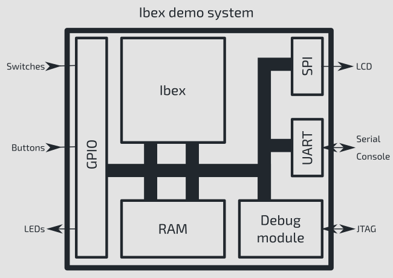
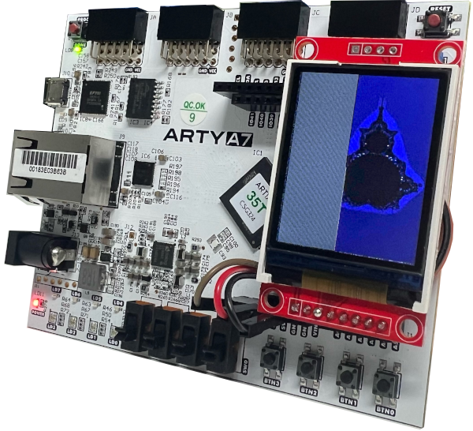

# Ibex Demo System



This an example RISC-V SoC targeting the Arty-A7 FPGA board. It comprises the
[lowRISC Ibex core](https://www.github.com/lowrisc/ibex) along with the
following features:

* RISC-V debug support (using the [PULP RISC-V Debug Module](https://github.com/pulp-platform/riscv-dbg))
* A UART
* GPIO (output only for now)
* Timer
* SPI
* A basic peripheral to write ASCII output to a file and halt simulation from software

Debug can be used via a USB connection to the Arty-A7 board. No external JTAG
probe is required.



## Software Requirements

* Xilinx Vivado - https://www.xilinx.com/support/download.html
* rv32imc GCC toolchain - lowRISC provides one:
  https://github.com/lowRISC/lowrisc-toolchains/releases
  (For example: `lowrisc-toolchain-rv32imcb-20220524-1.tar.xz`)
* cmake
* python3 - Additional python dependencies in python-requirements.txt installed with pip
* openocd (version 0.11.0 or above)
* screen
* srecord

## Container Guide

There is a prebuilt container of tools available you may want to use to get started quickly.
There are instructions for building the container for either Docker/Podman located in ./container/README.md.

**Linux/MacOS**

A container image may be provided to you on a USB stick. You can load the containerfile by running :
```bash
sudo docker load < ibex_demo_image.tar
# OR
podman load < ibex_demo_image.tar
```

If you already have a container file, you can start the container by running :
```bash
sudo docker run -it --rm \
  -p 6080:6080 \
  -p 3333:3333 \
  -v $(pwd):/home/dev/demo:Z \
  ibex
```
OR
```bash
podman unshare chown 1000:1000 -R .
podman run -it --rm \
  -p 6080:6080 \
  -p 3333:3333 \
  -v $(pwd):/home/dev/demo:Z \
  ibex
podman unshare chown 0:0 -R .
```
To access the container once running, go to [http://localhost:6080/vnc.html](http://localhost:6080/vnc.html).

If you want to program the FPGA from the container, lets find out which bus and device our Arty is on:
```bash
$ lsusb
...
Bus 00X Device 00Y: ID 0403:6010 Future Technology Devices International, Ltd FT2232C/D/H Dual UART/FIFO IC
...
```
Where X and Y are numbers. Please note down what X and Y is for you (this will change if you unplug and replug your FPGA).

Then run Docker with the following parameters:
```bash
sudo docker run -it --rm \
  -p 6080:6080 \
  -p 3333:3333 \
  -v $(pwd):/home/dev/demo:Z \
  --privileged \
  --device=/dev/bus/usb/00X/00Y \
  --device=/dev/ttyUSB1 \
  ibex
```

**Windows**

Run a command prompt in administrator mode and type:
```powershell
cd "C:\Program Files\Docker\Docker"
.\DockerCli.exe -SwitchLinuxEngine
```

Go to the folder on the USB named "Docker Images" and run:
```powershell
docker load -i ibex_demo_image.tar
```

Go to the folder where you have decompressed the demo system repository:
```powershell
docker run -it --rm -p 6080:6080 -p 3333:3333 -v %cd%:/home/dev/demo:Z ibex
```


#### Add udev rules for our device
These are needed for the programmer to access the development board.

Arty-A7
```bash

sudo su
cat <<EOF > /etc/udev/rules.d/90-arty-a7.rules
# Future Technology Devices International, Ltd FT2232C/D/H Dual UART/FIFO IC
# used on Digilent boards
ACTION=="add|change", SUBSYSTEM=="usb|tty", ATTRS{idVendor}=="0403", ATTRS{idProduct}=="6010", ATTRS{manufacturer}=="Digilent", MODE="0666"

# Future Technology Devices International, Ltd FT232 Serial (UART) IC
ACTION=="add|change", SUBSYSTEM=="usb|tty", ATTRS{idVendor}=="0403", ATTRS{idProduct}=="6001", MODE="0666"
EOF

exit
```

openFPGAloader
```bash
sudo su
cat <<EOF > /etc/udev/rules.d/99-openfpgaloader.rules
# Copy this file to /etc/udev/rules.d/

ACTION!="add|change", GOTO="openfpgaloader_rules_end"

# gpiochip subsystem
SUBSYSTEM=="gpio", MODE="0664", GROUP="plugdev", TAG+="uaccess"

SUBSYSTEM!="usb|tty|hidraw", GOTO="openfpgaloader_rules_end"

# Original FT232/FT245 VID:PID
ATTRS{idVendor}=="0403", ATTRS{idProduct}=="6001", MODE="664", GROUP="plugdev", TAG+="uaccess"

# Original FT2232 VID:PID
ATTRS{idVendor}=="0403", ATTRS{idProduct}=="6010", MODE="664", GROUP="plugdev", TAG+="uaccess"

# Original FT4232 VID:PID
ATTRS{idVendor}=="0403", ATTRS{idProduct}=="6011", MODE="664", GROUP="plugdev", TAG+="uaccess"

# Original FT232H VID:PID
ATTRS{idVendor}=="0403", ATTRS{idProduct}=="6014", MODE="664", GROUP="plugdev", TAG+="uaccess"

# Original FT231X VID:PID
ATTRS{idVendor}=="0403", ATTRS{idProduct}=="6015", MODE="664", GROUP="plugdev", TAG+="uaccess"

# anlogic cable
ATTRS{idVendor}=="0547", ATTRS{idProduct}=="1002", MODE="664", GROUP="plugdev", TAG+="uaccess"

# altera usb-blaster
ATTRS{idVendor}=="09fb", ATTRS{idProduct}=="6001", MODE="664", GROUP="plugdev", TAG+="uaccess"
ATTRS{idVendor}=="09fb", ATTRS{idProduct}=="6002", MODE="664", GROUP="plugdev", TAG+="uaccess"
ATTRS{idVendor}=="09fb", ATTRS{idProduct}=="6003", MODE="664", GROUP="plugdev", TAG+="uaccess"

# altera usb-blasterII - uninitialized
ATTRS{idVendor}=="09fb", ATTRS{idProduct}=="6810", MODE="664", GROUP="plugdev", TAG+="uaccess"
# altera usb-blasterII - initialized
ATTRS{idVendor}=="09fb", ATTRS{idProduct}=="6010", MODE="664", GROUP="plugdev", TAG+="uaccess"

# dirtyJTAG
ATTRS{idVendor}=="1209", ATTRS{idProduct}=="c0ca", MODE="664", GROUP="plugdev", TAG+="uaccess"

# Jlink
ATTRS{idVendor}=="1366", ATTRS{idProduct}=="0105", MODE="664", GROUP="plugdev", TAG+="uaccess"

# NXP LPC-Link2
ATTRS{idVendor}=="1fc9", ATTRS{idProduct}=="0090", MODE="664", GROUP="plugdev", TAG+="uaccess"

# NXP ARM mbed
ATTRS{idVendor}=="0d28", ATTRS{idProduct}=="0204", MODE="664", GROUP="plugdev", TAG+="uaccess"

# icebreaker bitsy
ATTRS{idVendor}=="1d50", ATTRS{idProduct}=="6146", MODE="664", GROUP="plugdev", TAG+="uaccess"

# orbtrace-mini dfu
ATTRS{idVendor}=="1209", ATTRS{idProduct}=="3442", MODE="664", GROUP="plugdev", TAG+="uaccess"

LABEL="openfpgaloader_rules_end"

EOF

exit

```

Run the following to reload the rules...

```bash
sudo udevadm control --reload-rules
sudo udevadm trigger
```

Add user to plugdev group.
```bash
sudo usermod -a $USER -G plugdev
```

<details>
  <summary>Installing environment using Nix (*alternative*)</summary>

## Nix Environment Setup

An alternative system for installing all of the project dependencies is
provided using the Nix package manager. Once installed and the dependencies
are fetched from the internet, you can enter a shell with all of the software
required for building by running the command `nix develop` in the root
directory of the project. To leave this environment, simply run `exit`.

### Installing

#### Installing Nix
```bash
# Run the recommended nix multi-user installation
# https://nixos.org/download.html
# This is an interactive installer, just follow the prompts...
sh <(curl -L https://nixos.org/nix/install) --daemon

# Add some global configuration to nix to make use of the flakes and CLI experimental features.
mkdir -p $HOME/.config/nix
cat <<EOF > $HOME/.config/nix/nix.conf
experimental-features = nix-command flakes
warn-dirty = false
EOF

# Disable signatures when using nix copy to import from a store
# This allows us to easily import from a cache on a local USB
sudo su
mkdir -p /etc/nix
cat <<EOF >> /etc/nix/nix.conf
require-sigs = false
EOF
exit

# Reload the nix daemon to commit the config above
sudo systemctl restart nix-daemon.service

# You may now need to reload your shell, but check that nix is working by running this:
nix --version
> nix (Nix) 2.12.0
```

#### Installing Vivado using Nix
```bash
# Go to the Xilinx.com website
# https://www.xilinx.com/support/download.html
# Download the 2022.2 Unified Installer for Linux
# The link looks like:
# <Xilinx Unified Installer 2022.2: Linux Self Extracting Web Installer (BIN - 271.02 MB)>
# The download link will be similar to:
# https://www.xilinx.com/member/forms/download/xef.html?filename=Xilinx_Unified_2022.2_1014_8888_Lin64.bin
# - You will need to register on the website to download this file.

# Once the download is complete...
cd <location/of/downloaded/file>

# Extract the installer to a local temporary directory
PREFIX=/tmp/xilinx
VERSION=2022.2
INSTALLER="<downloaded/file>"  # This should match the download
INSTALLER_EXTRACTED="${PREFIX}/extracted"
mkdir $PREFIX
chown -R $USER:$USER $PREFIX $INSTALLER
chmod +x $INSTALLER
./$INSTALLER --keep --noexec --target $INSTALLER_EXTRACTED

# Now run this installer graphically, to create a new bundled-installer with the device support we need for the Arty-A7.
INSTALLER_BUNDLED="$PREFIX/bundled"
pushd $INSTALLER_EXTRACTED
./xsetup
popd
```

- Running './xsetup' above should have popped up the graphical installation wizard.
  1. Page '<LANDING_PAGE>'
     1. Select 'Next >'
  2. Page 'Select Install Type'
     1. Enter email/password for 'User Authentication' (register on Xilinx.com)
     2. Select the radio-box 'Download Image (Install Seperately)'
     3. Select the download directory as '/tmp/xilinx/bundled' (the value from $INSTALLER_BUNDLED, See above)
     4. Under 'Download fields to create full image for selected platform(s)', select 'Linux' only.
     5. Under 'Image Contents', select 'Selected Product Only'
     6. Select 'Next >'
  3. Page 'Select Product to Install'
     1. Select the radio-box 'Vivado' only
     2. Select 'Next >'
  4. Page 'Select Edition to Install'
     1. Select the radio-box 'Vivado ML Standard'
     2. Select 'Next >'
  5. Page 'Vivado ML Standard'
     1. Ensure only the following boxes are selected....
        1. Design Tools - Vivado Design Suite - {Vivado, Vitis HLS}
        2. Devices - Production Devices - 7 Series - {Artix7, Kintex7, Spartan7}
        3. Installation Options
     2. Select 'Next >'
  6. Page 'Download Summary'
     1. Check the download is approx 13GB.
     1. Select 'Download'

```bash
# Now we have created a bundled installer for Vivado, we need to add this to the nix store

# The easiest way to get the data into the nix store is by creating an archive...
pushd $PREFIX
BUNDLED_ARCHIVE="$PREFIX/vivado_bundled.tar.gz"
# (You may need to install 'pigz' for this step, e.g. 'sudo apt install pigz')
tar cf $BUNDLED_ARCHIVE -I pigz --directory=$(dirname $INSTALLER_BUNDLED) ./$(basename $INSTALLER_BUNDLED)

# Now add using 'nix-prefetch-url'
VIVADO_BUNDLED_HASH=$(nix-prefetch-url --type sha256 file:$BUNDLED_ARCHIVE)

# The value of this hash will be needed for the next step.
echo $VIVADO_BUNDLED_HASH
popd
```

#### Install dependencies and activate our environment
We can use the nix flake.nix recipe to build our environment.
```bash
git clone git@github.com:lowRISC/ibex-demo-system.git
cd ibex-demo-system

# [OPTIONAL]
# Copy dependencies from a pre-prepared USB stick to compensate for bad internet
# The hash below is the expected hash of the lab dependencies
usb_path="<path/to/usb>" # e.g. "/media/harry/KINGSTON"
nix copy \
  --no-require-sigs \
  --from file://${usb_path}/nix/store/ \
  /nix/store/kx1qnhs2b6ikn5s4mj7jpj84rasqwc2h-labenv

pushd dependencies && nix flake update && popd && nix flake update
nix develop

# Once it completes,you should see the lowRISC logo, followed by...
# >> ------------------------------------------------- <<
# >> Welcome the the ibex-demo-system nix environment! <<
# >> ------------------------------------------------- <<

# You are now in a shell with all the tools required to do the lab.

# To exit this shell environment when you are done, simply run
exit

# Bonus Nix
# Use nix-tree to interactively examine all dependencies of the demo.
nix run nixpkgs#nix-tree -- .#devShells.x86_64-linux.default --derivation
```

Vivado-specific change (only needed if enabled in flake.nix):
```bash
# Run this before the `nix flake update` above.

# Update the flake.nix with the hash ($VIVADO_BUNDLED_HASH) of the vivado installer
# (We need to update just the sha256 hash input of requireFile function.)
sed -i -- "s|sha256\s=\s\".*\";|sha256 = \"$VIVADO_BUNDLED_HASH\";|g" dependencies/flake.nix
```

</details>

## Native Python Environment

(NOT NEEDED IN THE CONTAINER ENVIRONMENT)

To install python dependencies use pip, you may wish to do this inside a virtual
environment to avoid disturbing you current python setup (note it uses a lowRISC
fork of edalize and FuseSoC so if you already use these a virtual environment is
recommended)

```bash
# Setup python venv
python3 -m venv .venv
source .venv/bin/activate

# Install python requirements
pip3 install -r python-requirements.txt
```

You may need to run the last command twice if you get the following error:
`ERROR: Failed building wheel for fusesoc`


## Building Software

First the software must be built.
This can be loaded into an FPGA to run on a synthesized Ibex processor, or passed
to a verilator simulation model to be simulated on a PC.

```
mkdir sw/build
pushd sw/build
cmake ../
make
popd
```

Note the FPGA build relies on a fixed path to the initial binary (blank.vmem) so
if you want to create your build directory elsewhere you need to adjust the path
in `ibex_demo_system.core`

## Building Simulation

The Demo System simulator binary can be built via FuseSoC. From the Ibex
repository root run:

```
fusesoc --cores-root=. run --target=sim --tool=verilator --setup --build lowrisc:ibex:demo_system
```
## Running the Simulator

Having built the simulator and software, to simulate using Verilator we can use the following commands.
`<sw_elf_file>` should be a path to an ELF file  (or alternatively a vmem file)
built as described above. Use `./sw/build/demo/hello_world/demo` to run the `demo`
binary.

Run from the repository root run:
```
# For example :
./build/lowrisc_ibex_demo_system_0/sim-verilator/Vibex_demo_system [-t] \
  --meminit=ram,./sw/build/demo/hello_world/demo

# You need to substitute the <sw_elf_file> for a binary we have build above.
./build/lowrisc_ibex_demo_system_0/sim-verilator/Vibex_demo_system [-t] --meminit=ram,<sw_elf_file>

```

Pass `-t` to get an FST trace of execution that can be viewed with
[GTKWave](http://gtkwave.sourceforge.net/).

```
Simulation statistics
=====================
Executed cycles:  5899491
Wallclock time:   1.934 s
Simulation speed: 3.05041e+06 cycles/s (3050.41 kHz)

Performance Counters
====================
Cycles:                     457
NONE:                       0
Instructions Retired:       296
LSU Busy:                   108
Fetch Wait:                 20
Loads:                      53
Stores:                     55
Jumps:                      21
Conditional Branches:       12
Taken Conditional Branches: 7
Compressed Instructions:    164
Multiply Wait:              0
Divide Wait:                0
```

## Building FPGA bitstream
FuseSoC handles the FPGA build. Vivado tools must be setup beforehand. From the
repository root:

```
fusesoc --cores-root=. run --target=synth --setup --build lowrisc:ibex:demo_system
```

## Programming FPGA

To program the FPGA, either use FuseSoC again

```
fusesoc --cores-root=. run --target=synth --run lowrisc:ibex:demo_system

# If the above does not work, try executing the programming operation manually with..
make -C ./build/lowrisc_ibex_demo_system_0/synth-vivado/ pgm
```

## Loading an application to the programmed FPGA

The util/load_demo_system.sh script can be used to load and run an application. You
can choose to immediately run it or begin halted, allowing you to attach a
debugger.

```bash
# Run demo
./util/load_demo_system.sh run ./sw/build/demo/hello_world/demo
./util/load_demo_system.sh run ./sw/build/demo/lcd_st7735/lcd_st7735

# Load demo and start halted awaiting a debugger
./util/load_demo_system.sh halt ./sw/build/demo/hello_world/demo
```

To view terminal output use screen:

```bash
# Look in /dev to see available ttyUSB devices
screen /dev/ttyUSB1 115200
```

If you see an immediate `[screen is terminating]`, it may mean that you need super user rights.
In this case, you may try using `sudo`.

To exit from the `screen` command, you should press control and a together, then release these two keys and press d.

## Debugging an application

Either load an application and halt (see above) or start a new OpenOCD instance

```
openocd -f util/arty-a7-openocd-cfg.tcl
```

Then run GDB against the running binary and connect to localhost:3333 as a
remote target

```
riscv32-unknown-elf-gdb ./sw/build/demo/hello_world/demo

(gdb) target extended-remote localhost:3333
```
